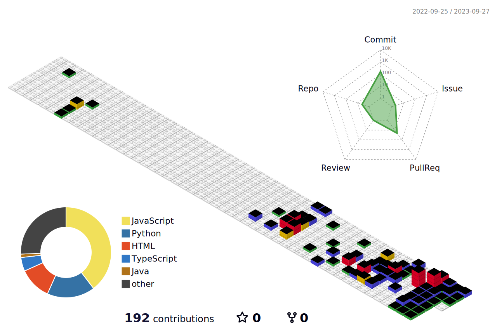

		

	<h2>📚 Tech Stack 📚</h2>
	<h4>✨ Platforms & Languages ✨</h4>

	 

	
	 
	
	
	
	
	 
	
	

<!--  -->
	

	 
	

<!-- 	 -->
	
	
 

 

 

	<h4>🛠 Tools 🛠</h4>

	
	
	
	
	
	

 

	<h4>🎨 SNS & Portfolio 🎨</h4>

	
	
	
	 

	 

 
<h4>🏆 Baekjoon solved rank 🏆</h4>
	

 

