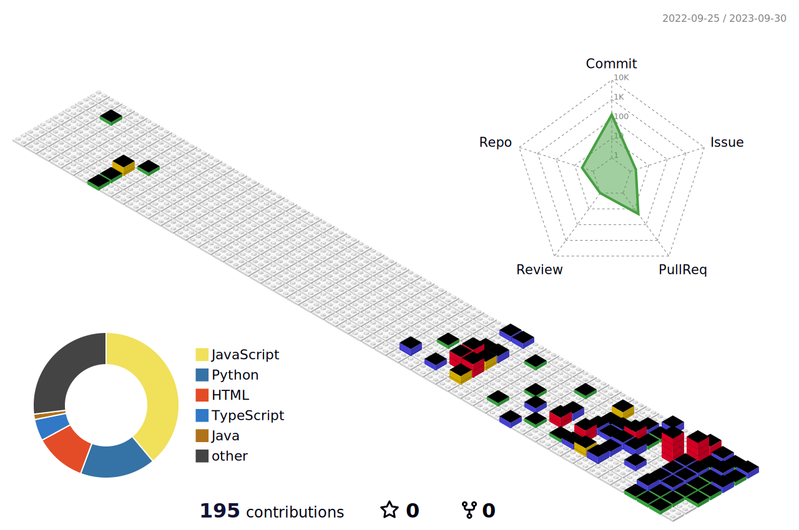

  <h3>서예진 Suh Yejin👨‍💻</h3>
  <h6> Frontend Developer</h6>
  
  

<h2></h2>

  <li>홍익대학교 컴퓨터공학과 (2018.03 ~ 2023.02)</li>
  <li><b>Digital Hana路 금융 서비스 개발 1기(2023.04 ~ )</b></li>
   
  <li>홍익대학교 컴퓨터공학과 밴드학회 [<a href="https://github.com/Gosrock">고스락</a> 공연 티켓 예매 서비스] 1차<a href="https://github.com/Gosrock/Ticket-Admin-21st"> Admin</a> (2022.01 ~ 2022.03)</li>
  <li>홍익대학교 컴퓨터공학과 밴드학회 [<a href="https://github.com/Gosrock">고스락</a> 공연 티켓 예매 서비스] 2차 <a href="https://github.com/Gosrock/Ticket-Front-22nd">FE</a> (2022.07 ~ 2022.08)</li>
  <li>alpaco 주변 맛집 추천 웹사이트 <a href="https://github.com/buyMeFood-Project/buyMeFood">BuyMeFood</a> FE (2023.05 ~ 2023.06)</li>
  <li>카드사 카드 관리 시스템 <a href="https://github.com/CardSystem/Server">CardTracker</a> FE • BE (2023.06)</li>
  <li>은행 기반 여행 모바일 어플리케이션 <a href="https://github.com/hanaro-3rd/frontend">KeyLog</a> FE (2023.07 ~ 2023.08)</li>

  <h2></h2>
  
 
 
	 <h3>🛠 Tech Stack </h3>

#### 📌PL	 

 

#### 💻FE

 	

<!--  -->
	

	 
	

<!-- 	 -->
	

 

#### 🧰Tools

 

 
 
 

 

